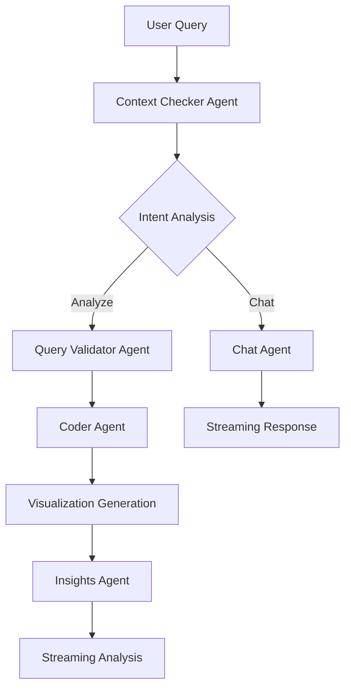

# ⚙️ Omega - AI Data Analyst

> Transform your spreadsheets into insights through conversation. No SQL, no coding, just natural language questions about your data.

[](https://python.org)
[](https://streamlit.io)
[](https://openai.com)
[](LICENSE)

## 🚀 Quick Start

### Demo


### Features
- 📤 **Easy Upload** - Drag & drop CSV/Excel files with automatic data preview
- 💬 **Natural Language** - Ask questions in plain English like "show me sales trends"  
- 📊 **Auto Visualization** - AI generates appropriate charts with professional styling
- 🧠 **AI Insights** - Real-time analysis with pattern identification and business recommendations
- ⚡ **Multi-Agent System** - Specialized AI agents for different tasks (context checking, visualization, insights)

## 🏗️ Architecture

Omega uses a sophisticated multi-agent architecture:



### Agent Responsibilities

| Agent | Purpose | Technology |
|-------|---------|------------|
| **Context Checker** | Determines user intent (chat vs analyze) | GPT-4o-mini |
| **Chat Agent** | Handles conversational queries about data | GPT-4o-mini + Streaming |
| **Query Validator** | Verifies if analysis is possible with available data | GPT-4o-mini |
| **Coder Agent** | Generates matplotlib visualization code | GPT-4o-mini |
| **Insights Agent** | Provides business intelligence from visualizations | GPT-4o-mini + Vision |

## 📋 Prerequisites

- Python 3.8 or higher
- OpenAI API key
- Internet connection

## 🔧 Installation

### Option 1: Clone Repository
```bash
git clone https://github.com/yourusername/omega-ai-analyst.git
cd omega-ai-analyst
pip install -r requirements.txt
```

### Option 2: Direct Download
1. Download `omega_analyst.py` 
2. Install dependencies:
```bash
pip install streamlit openai pandas numpy matplotlib pillow openpyxl
```

## ⚙️ Configuration

### Method 1: Streamlit Secrets (Recommended)
Create `.streamlit/secrets.toml`:
```toml
OPENAI_API_KEY = "sk-your-api-key-here"
```

### Method 2: Environment Variable
```bash
export OPENAI_API_KEY="sk-your-api-key-here"
```

### Method 3: Direct Input
The app will prompt for your API key if not found in the above methods.

## 🚀 Usage

### Starting the Application
```bash
streamlit run omega_analyst.py
```

### Basic Workflow
1. **Upload Data** - Drag and drop your CSV/Excel file
2. **Ask Questions** - Use natural language to query your data
3. **Get Insights** - Receive visualizations and AI-powered analysis

### Example Queries

#### Analysis Queries (Generate Visualizations)
- "Show me sales trends over time"
- "Plot revenue by region" 
- "What's the correlation between price and quantity?"
- "Display the top 10 customers by revenue"
- "Create a histogram of product prices"

#### Chat Queries (Conversational Help)
- "What columns are available in this dataset?"
- "How should I analyze sales data?"
- "What are the important metrics to look at?"
- "Can you help me understand this data?"
- "What questions should I ask about my data?"

## 🎯 Supported Data Types

| File Format | Extension | Notes |
|-------------|-----------|-------|
| CSV | `.csv` | UTF-8 encoding recommended |
| Excel | `.xlsx`, `.xls` | All sheets supported |

### Data Requirements
- Clean column headers (no special characters recommended)
- Consistent data types within columns
- Reasonable file size (< 100MB for optimal performance)

## 🔍 Features Deep Dive

### Intelligent Context Detection
Omega automatically determines whether you want to:
- **Chat** about your data (get guidance, explanations)
- **Analyze** your data (create visualizations, run calculations)

### Smart Column Matching
The system intelligently maps your natural language requests to actual column names:
- "sales" → matches `Sales`, `Revenue`, `Total_Sales`, `Sales_Amount`
- "customer" → matches `Customer`, `Customer_ID`, `Client`, `Client_Name`
- "date" → matches `Date`, `Time`, `Created_At`, `Order_Date`

### Professional Visualizations
Generated charts include:
- Publication-quality styling
- Appropriate color schemes
- Comprehensive labels and legends
- Statistical overlays (trend lines, correlations)
- Professional formatting

### Real-time Streaming Analysis
- Insights appear as they're generated
- Structured business intelligence framework
- Actionable recommendations
- Statistical significance testing

## 🛠️ Technical Details

### Dependencies
```python
streamlit>=1.28.0
openai>=1.3.0
pandas>=1.5.0
numpy>=1.24.0
matplotlib>=3.6.0
pillow>=9.0.0
openpyxl>=3.1.0
```

### API Usage
- Model: GPT-4o-mini for optimal cost/performance balance
- Timeout: 30-90 seconds depending on operation
- Streaming: Real-time response display
- Rate limiting: Built-in retry logic

### Performance Optimization
- Efficient data sampling for large datasets
- Optimized visualization generation
- Smart caching for repeated queries
- Minimal API calls through intelligent routing

## 🔒 Security & Privacy

- **No Data Storage**: Your data stays in memory during the session only
- **API Security**: OpenAI API key is required but not stored
- **Local Processing**: All data processing happens locally
- **No External Dependencies**: No third-party data sharing

## 📊 Example Use Cases

### Business Intelligence
- Sales performance analysis
- Revenue trend monitoring
- Customer segmentation
- Product performance comparison
- Regional analysis

### Data Science
- Exploratory data analysis (EDA)
- Statistical correlation discovery
- Distribution analysis
- Outlier detection
- Pattern identification

### Operations
- KPI monitoring
- Performance benchmarking
- Trend forecasting
- Quality analysis
- Resource optimization

## 🐛 Troubleshooting

### Common Issues

#### API Key Problems
```
❌ Invalid API key format
```
**Solution**: Ensure your OpenAI API key starts with `sk-`

#### Timeout Errors
```
❌ Request timeout occurred
```
**Solutions**:
- Check internet connection speed
- Disable VPN temporarily
- Try from a different network
- Check OpenAI status page

#### Data Loading Issues
```
❌ Error loading dataset
```
**Solutions**:
- Ensure file is properly formatted CSV/Excel
- Check for special characters in column names
- Verify file isn't corrupted
- Try smaller dataset first

#### Visualization Errors
```
❌ Failed to generate visualization
```
**Solutions**:
- Check if requested columns exist in data
- Try rephrasing your question
- Ensure data types are appropriate
- Use simpler query first

### Getting Help
1. Check the [Issues](../../issues) page for similar problems
2. Review the troubleshooting section above
3. Create a new issue with:
   - Error message
   - Steps to reproduce
   - Dataset characteristics (without sharing actual data)

## 🤝 Contributing

We welcome contributions! See [CONTRIBUTING.md](CONTRIBUTING.md) for guidelines.

### Development Setup
```bash
git clone https://github.com/yourusername/omega-ai-analyst.git
cd omega-ai-analyst
python -m venv venv
source venv/bin/activate  # On Windows: venv\Scripts\activate
pip install -r requirements.txt
pip install -r requirements-dev.txt
```

### Running Tests
```bash
pytest tests/
```

## 📈 Roadmap

### Version 2.0 (Coming Soon)
- [ ] Support for SQL databases
- [ ] Advanced statistical tests
- [ ] Export functionality (PDF reports)
- [ ] Custom visualization templates
- [ ] Multi-file analysis

### Future Enhancements
- [ ] Real-time data streaming
- [ ] Collaborative features
- [ ] Advanced ML capabilities
- [ ] Cloud deployment options
- [ ] Mobile app support

## 📄 License

This project is licensed under the MIT License - see the [LICENSE](LICENSE) file for details.

## 🙏 Acknowledgments

- [Streamlit](https://streamlit.io) for the amazing web framework
- [OpenAI](https://openai.com) for powerful language models
- [Matplotlib](https://matplotlib.org) for visualization capabilities
- The open-source community for inspiration and support

## 📞 Support

- 📧 Email: support@omega-analyst.com
- 💬 Discord: [Join our community](https://discord.gg/omega-analyst)
- 📚 Documentation: [Full docs](https://docs.omega-analyst.com)
- 🐛 Issues: [GitHub Issues](../../issues)

---

<p align="center">Made with ❤️ by the Omega Team</p>
<p align="center">⭐ Star this repo if you found it helpful!</p>
